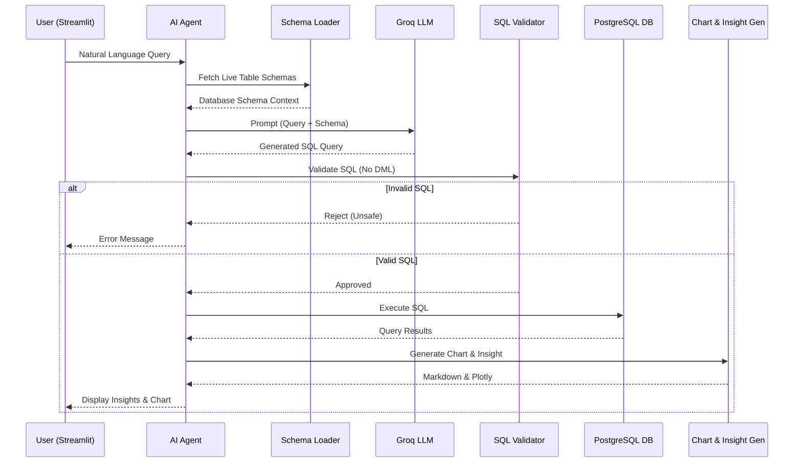

# AI Data Analyst Agent

This document outlines the architecture and workflow of the natural language analytics assistant integrated into the dashboard.

## Agent Architecture and Workflow

The AI agent dynamically reads PostgreSQL schemas, formulates valid read-only SQL, executes it, and generates visualizations and natural language insights.

## Security & Features
- **Strict Security Layer**: A Regex-based validator blocks any `INSERT`, `UPDATE`, `DELETE`, `DROP`, `ALTER`, or semicolon-chained statements. 
- **Dynamic Context**: Automatically scans `information_schema` so prompt building incorporates the live table definitions without hardcoding.
- **Fast Inference**: Utilizes the Groq LLM inference engine.
