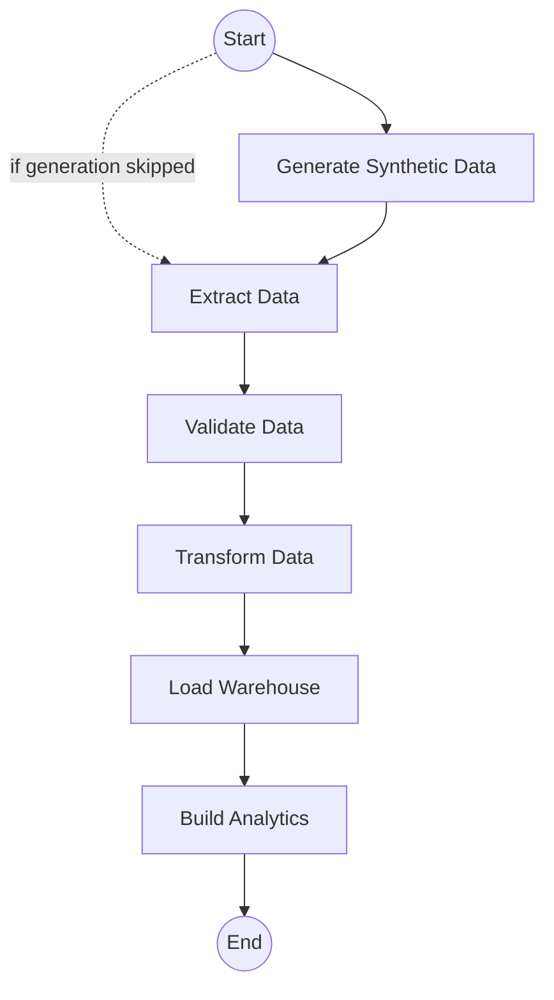

# Airflow Orchestration

This document describes the orchestration of data pipelines using Apache Airflow.

## DAG Design

The main DAG is `retail_intelligence_pipeline`, which orchestrates the end-to-end flow.
Airflow is responsible for scheduling, dependency management, and triggering external systems (like Spark and PostgreSQL).

## Operators Overview
- **DataGenerationOperator**: Triggers the generation of synthetic retail data.
- **ExtractionOperator**: Ingests raw data from various sources to the `staging` schema.
- **ValidationOperator**: Runs data quality checks to ensure data conforms to expected formats and limits.
- **TransformationOperator**: Prepares, cleans, and structures data into business-ready formats.
- **WarehouseOperator**: Loads the prepared data into the `warehouse` star schema tables.
- **AnalyticsOperator**: Invokes analytical jobs (SQL aggregations or Spark).
