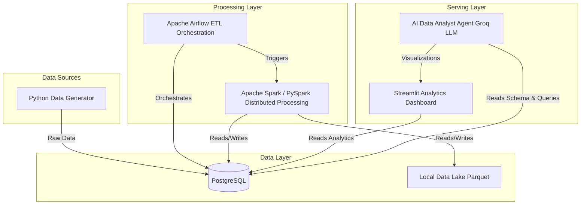

# Retail Intelligence Platform Architecture

This document outlines the overall architecture of the Retail Intelligence Platform.

## System Architecture

## Tech Stack Overview
- **Orchestration**: Apache Airflow
- **Data Warehouse**: PostgreSQL (Star Schema)
- **Big Data Processing**: Apache Spark (PySpark)
- **Business Intelligence**: Streamlit
- **AI Analytics**: Groq API + LangChain/Custom Python Agent
- **Deployment**: Docker, Docker Compose
