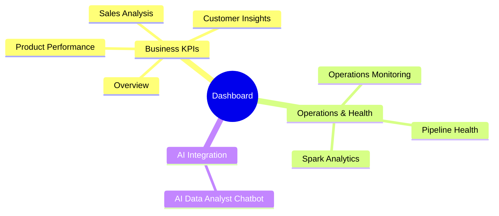

# Streamlit Analytics Dashboard

This document details the BI and observability dashboard.

## Overview
The dashboard connects to the PostgreSQL database (`analytics` schema, `warehouse` schema, and `airflow` metadata schema) to provide business KPIs and pipeline monitoring in a single unified view. It is strictly a **data consumption layer**. Large datasets are pre-aggregated in the backend (via SQL views or Spark).

## Dashboard Features Map

## Page Breakdowns
1. **Overview**: High-level business KPIs.
2. **Sales Analysis**: Deep dive into revenue and category performance.
3. **Customer Insights**: Segmentation and Customer Lifetime Value (CLV).
4. **Product Performance**: Inventory and top sellers.
5. **Operations Monitoring**: Supply chain and warehouse status.
6. **Pipeline Health**: Airflow orchestration observability, showing DAG and Task execution success rates.
7. **Spark Analytics**: Visualization of heavy Spark workloads (like sessionization and event funnels).
8. **AI Analyst**: Natural-language data analyst for dynamic queries and insights.
