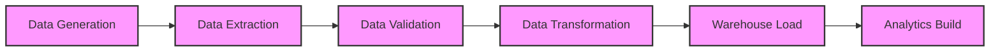

# ETL Data Flow

This document outlines the step-by-step ETL (Extract, Transform, Load) data flow orchestrated by Apache Airflow.

## End-to-End Pipeline

## Description of Stages
1. **Data Generation**: Generates synthetic upstream retail datasets (customers, products, orders, events).
2. **Data Extraction**: Extracts source data (CSV, JSON, APIs) and lands them in raw storage.
3. **Data Validation**: Checks schema, completeness, uniqueness, referential expectations, and accepted value ranges.
4. **Data Transformation**: Cleans, enriches, standardizes, and prepares data for the warehouse.
5. **Warehouse Load**: Loads transformed data into the PostgreSQL star schema.
6. **Analytics Build**: Triggers analytical queries and Spark jobs to compute aggregations, metrics, and sessionization.
