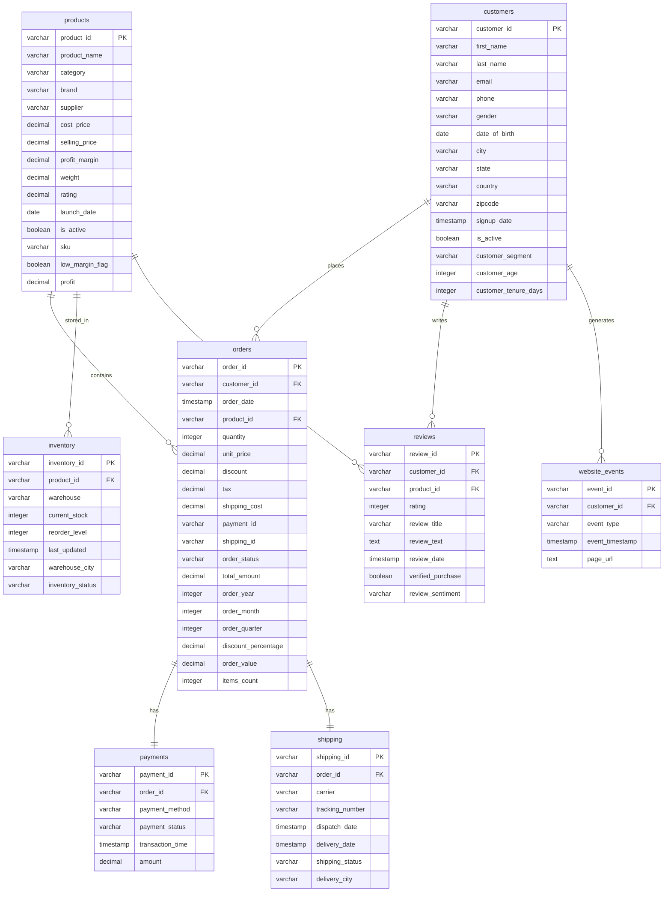

# Database Schema

This document outlines the PostgreSQL database schema for the Retail Intelligence Platform.

## Schemas
1. **staging**: Used for landing raw extracted data.
2. **warehouse**: Stores the core Star Schema entities.
3. **metadata**: Stores pipeline metadata and data quality metrics.
4. **analytics**: (Implicitly created/managed by Spark or Analytics operators) Stores pre-aggregated views and reports.

## Warehouse Star Schema Diagram

