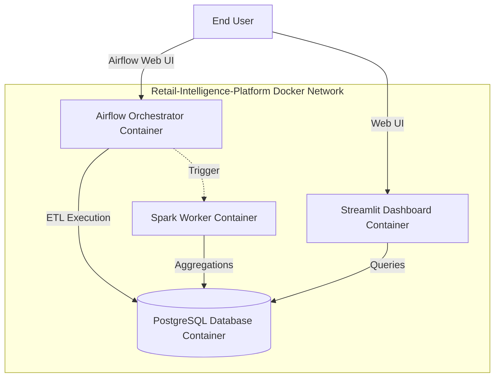

# Deployment & Infrastructure

This document outlines the deployment architecture using Docker and Docker Compose.

## Container Architecture



## Setup Instructions

1. **Prerequisites**: Ensure Docker and Docker Compose are installed.
2. **Environment File**: Configure your `.env` file from the provided `.env.example`. Make sure your `GROQ_API_KEY` is present.
3. **Build and Run**:
   ```bash
   docker-compose up --build -d
   ```
4. **Accessing Services**:
   - Streamlit Dashboard: `http://localhost:8501`
   - Airflow UI: `http://localhost:8080`
   - PostgreSQL: `localhost:5432`

## Persistence
Database data is mapped to a local volume to persist between restarts. Logs and raw data exports are also mapped to host volumes to ensure easy debugging.
