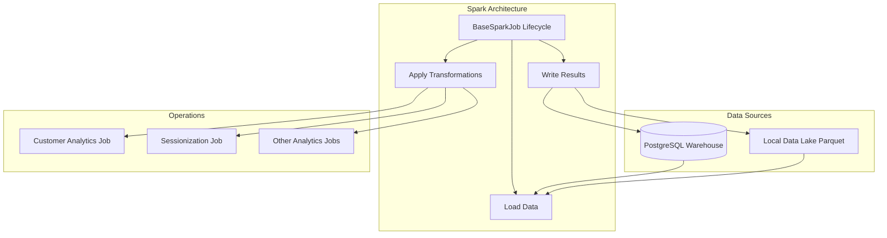

# Apache Spark Distributed Processing Layer

This document outlines the usage of PySpark within the platform.

## Why Spark?

While standard Python (Pandas) and PostgreSQL (SQL) are excellent for many transformations, they can bottleneck when processing massive, high-volume datasets like raw behavioral `website_events` or executing complex window functions over unbounded histories. 
Spark is used as an **acceleration layer** to compute heavy analytical workloads efficiently via distributed in-memory computing.

## Job Pipeline Architecture

Every job inherits from `BaseSparkJob` enforcing a clean `load -> transform -> write` lifecycle. Transformations are strictly isolated to enable unit testing.

## Available Jobs
1. **Customer Analytics Job**: Computes Customer Lifetime Value (CLV) and purchase frequency.
2. **Sessionization Job**: Uses Spark window functions and time-gap logic to convert a flat stream of website events into unique user sessions.
3. **Order / Product / Revenue / Event Jobs**: Computes aggregated insights.

## Integration
Spark jobs are cleanly integrated with Airflow DAGs. Airflow serves as the orchestrator triggering `spark.jobs.job_name.main()`.
